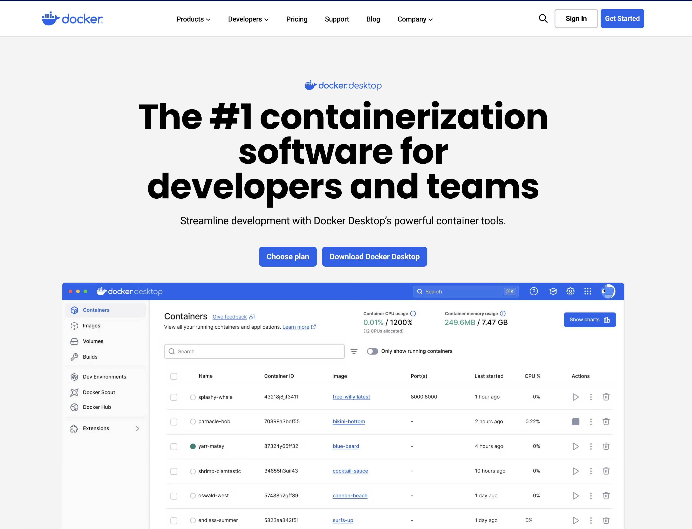
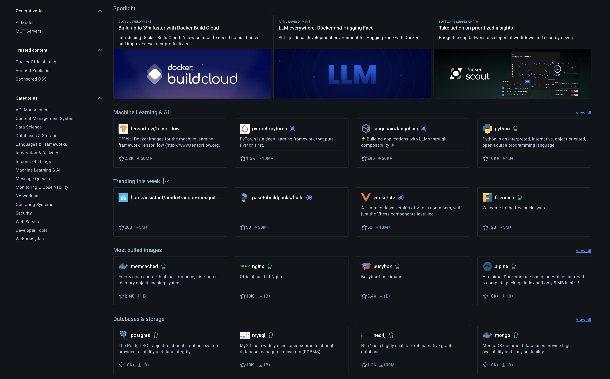

# Getting Started with Docker for Data Science Workshop 

Materials for the Getting Started with Docker for Data Science Workshop at the Data Science Day at UNH Peter T. Paul College of Business and Economics.

**When 📆:** Tuesday, June 17th, 11:00 PST

## Prerequisites

This is a beginner level tutorial, and it does not require any prior knowledge. However, it is recommended that you have some basic understanding of command line commands. 

To run the examples in this tutorial you will need:
- Docker Desktop (or eqvalent) installed on your computer
- Docker Hub account

### Installing Docker Desktop
 
Docker was built to run on Linux OS, and therefore, it cannot run natively on other OSs such as macOS and Windows. The Docker Desktop provides the necessary virtual environment on which you can run Docker containers outside of Linux OS. In addition, it provides a GUI interface for managing the alocated resources and containers.

To install Docker Desktop, go to [Docker website](https://www.docker.com/products/docker-desktop) and follow the instructions for your operating system: 

<br>
<br /><figure>
 </a>
<figcaption> Docker Desktop</figcaption>
</figure>

<br>
<br />

After you have installed Docker Desktop, it should launch it automaticly. If it does not launch automatically, click on the icon in the top right corner of the screen (on macOS).

You can validate from the terminal if Docker is running by typing `docker --version`:
```shell
>docker --version                                                          
Docker version 28.0.4, build b8034c0
```


### Setting Up Docker Hub Account

Docker Hub is a public repository that allows you to store, share, and run your containers (as GitHub enables you to store and maintain code). To set up your Docker Hub account, go to [Docker Hub](https://hub.docker.com/) and follow the instructions.


<br>
<br /><figure>
 </a>
<figcaption> Docker Hub</figcaption> 
</figure>

<br>
<br />


## Getting Started with Docker

### Hello World!

To check that your Docker installation is working correctly, login to your Docker Hub account using `docker login`:
```
Authenticating with existing credentials... [Username: USERNAME]

i Info → To login with a different account, run 'docker logout' followed by 'docker login'


Login Succeeded
```

And run the Docker Hello World example from the terminal using the following command:
``` shell
docker run hello-world
```

This should print the following output:
``` shell
Unable to find image 'hello-world:latest' locally
latest: Pulling from library/hello-world
c9c5fd25a1bd: Pull complete
Digest: sha256:940c619fbd418f9b2b1b63e25d8861f9cc1b46e3fc8b018ccfe8b78f19b8cc4f
Status: Downloaded newer image for hello-world:latest

Hello from Docker!
This message shows that your installation appears to be working correctly.

To generate this message, Docker took the following steps:
 1. The Docker client contacted the Docker daemon.
 2. The Docker daemon pulled the "hello-world" image from the Docker Hub.
    (arm64v8)
 3. The Docker daemon created a new container from that image which runs the
    executable that produces the output you are currently reading.
 4. The Docker daemon streamed that output to the Docker client, which sent it
    to your terminal.

To try something more ambitious, you can run an Ubuntu container with:
 $ docker run -it ubuntu bash

Share images, automate workflows, and more with a free Docker ID:
 https://hub.docker.com/

For more examples and ideas, visit:
 https://docs.docker.com/get-started/

```


### Docker Pull

The `docker pull` command, as the nanme implies, enables the pull of images from the docker registry. For example, let's pull `base-r` image from the [Rocker project registery](https://rocker-project.org/):

``` shell
docker pull rocker/r-base
```
If this the image is not available locally, it will be downloaded from the registry:

``` shell
Using default tag: latest
latest: Pulling from rocker/r-base
0c8d1bdb469b: Pull complete
7cc066f46a7f: Pull complete
fdde0114116f: Pull complete
c4edb833c012: Pull complete
bfa02bb5331e: Pull complete
aa9dda64b772: Pull complete
Digest: sha256:40fb0a949029b91a86f0a5b091b698977d3d7cd70a22f744e79ddce06812de78
Status: Downloaded newer image for rocker/r-base:latest
docker.io/rocker/r-base:latest
```

### List the Local Images

The `docker images` command lists all the available images on your system:

``` shell
docker images
```

This returns the following output:
``` shell
REPOSITORY                        TAG           IMAGE ID       CREATED        SIZE
rocker/r-base                     latest        40fb0a949029   4 days ago     1.34GB
rkrispin/dynamic_agent            ex5           8576509b8fd6   2 weeks ago    258MB
rkrispin/simple_agent             ex4           8560d2a2a200   2 weeks ago    258MB
rkrispin/dynamic_agent            ex4           8461c53b3710   2 weeks ago    258MB
rkrispin/r-ladies-rome-workshop   arm64.4.4.0   072b70e6067f   3 weeks ago    8.65GB
rkrispin/baser                    arm64.4.4.0   23c78f1bb6a9   3 weeks ago    8.55GB
rkrispin/vscode-python            ex3           1a453febfa8f   3 weeks ago    1.54GB
rkrispin/vscode-python            ex2           c7847b360c95   3 weeks ago    1.54GB
rkrispin/vscode-python            ex1           c77ae9e8483d   3 weeks ago    1.48GB
rkrispin/nixtla_poc               0.0.2         38e8395157ce   4 weeks ago    3.65GB
rkrispin/nixtla_poc               0.0.1         b661d153e8c7   4 weeks ago    3.65GB
rkrispin/python-odsc-2025         arm64.0.0.1   8d84b0441e51   4 weeks ago    2.72GB
python                            3.10          7118d485696a   5 weeks ago    1.45GB
rkrispin/eia-airflow-dev          arm64.0.0.2   ca492ccd9828   2 months ago   4.31GB
hello-world                       latest        940c619fbd41   4 months ago   17kB
```

### Inspect the Image 

The `docker inspect` command will give you a lot of information about your image, including its ID, size, and other metadata. Here's an example output:

```bash
docker inspect rocker/r-base
```

This returns a details information in a JSON format:

``` json
[
    {
        "Id": "sha256:40fb0a949029b91a86f0a5b091b698977d3d7cd70a22f744e79ddce06812de78",
        "RepoTags": [
            "rocker/r-base:latest"
        ],
        "RepoDigests": [
            "rocker/r-base@sha256:40fb0a949029b91a86f0a5b091b698977d3d7cd70a22f744e79ddce06812de78"
        ],
        "Parent": "",
        "Comment": "buildkit.dockerfile.v0",
        "Created": "2025-06-13T10:15:45.500311387-05:00",
        "DockerVersion": "",
        "Author": "",
        "Config": {
            "Hostname": "",
            "Domainname": "",
            "User": "",
            "AttachStdin": false,
            "AttachStdout": false,
            "AttachStderr": false,
            "Tty": false,
            "OpenStdin": false,
            "StdinOnce": false,
            "Env": [
                "PATH=/usr/local/sbin:/usr/local/bin:/usr/sbin:/usr/bin:/sbin:/bin",
                "LC_ALL=en_US.UTF-8",
                "LANG=en_US.UTF-8",
                "R_BASE_VERSION=4.5.1"
            ],
            "Cmd": [
                "R"
            ],
            "ArgsEscaped": true,
            "Image": "",
            "Volumes": null,
            "WorkingDir": "",
            "Entrypoint": null,
            "OnBuild": null,
            "Labels": {
                "org.opencontainers.image.authors": "Dirk Eddelbuettel <edd@debian.org>",
                "org.opencontainers.image.licenses": "GPL-2.0-or-later",
                "org.opencontainers.image.source": "https://github.com/rocker-org/rocker",
                "org.opencontainers.image.vendor": "Rocker Project"
            }
        },
        "Architecture": "amd64",
        "Os": "linux",
        "Size": 376013007,
        "GraphDriver": {
            "Data": null,
            "Name": "overlayfs"
        },
        "RootFS": {
            "Type": "layers",
            "Layers": [
                "sha256:5969267de1a1ceed9966e87eca94c824c079c72a839c049e64ef2af0cbe9f101",
                "sha256:93cda266aa276146e380367621baff4749f5012eda4f6306c1b860f302bcf667",
                "sha256:1d23be2ddfd03154c37ebef3dc4f6828560d3f67649d888bd8f55f9e1a4cdcaf",
                "sha256:b2c5e942266c789441dfea40ddbeba99d4bf7026955376a0ca48109de9f97463",
                "sha256:cb7175931f834b41405486134d35c78c90f15da103fede87797b9dea20b425ed",
                "sha256:69af0957a6f4a8e862be9da41d632c504aedd3d8fa3d0d1cd5cc7d660e1e5893"
            ]
        },
        "Metadata": {
            "LastTagTime": "2025-06-17T15:49:01.905518253Z"
        },
        "Descriptor": {
            "mediaType": "application/vnd.docker.distribution.manifest.v2+json",
            "digest": "sha256:40fb0a949029b91a86f0a5b091b698977d3d7cd70a22f744e79ddce06812de78",
            "size": 1579
        }
    }
]

 ~/Projects/tutorials/R-Medicine-VScode-Workshop  main  docker inspect rocker/r-base | jq .                                                               ok
[
  {
    "Id": "sha256:40fb0a949029b91a86f0a5b091b698977d3d7cd70a22f744e79ddce06812de78",
    "RepoTags": [
      "rocker/r-base:latest"
    ],
    "RepoDigests": [
      "rocker/r-base@sha256:40fb0a949029b91a86f0a5b091b698977d3d7cd70a22f744e79ddce06812de78"
    ],
    "Parent": "",
    "Comment": "buildkit.dockerfile.v0",
    "Created": "2025-06-13T10:15:45.500311387-05:00",
    "DockerVersion": "",
    "Author": "",
    "Config": {
      "Hostname": "",
      "Domainname": "",
      "User": "",
      "AttachStdin": false,
      "AttachStdout": false,
      "AttachStderr": false,
      "Tty": false,
      "OpenStdin": false,
      "StdinOnce": false,
      "Env": [
        "PATH=/usr/local/sbin:/usr/local/bin:/usr/sbin:/usr/bin:/sbin:/bin",
        "LC_ALL=en_US.UTF-8",
        "LANG=en_US.UTF-8",
        "R_BASE_VERSION=4.5.1"
      ],
      "Cmd": [
        "R"
      ],
      "ArgsEscaped": true,
      "Image": "",
      "Volumes": null,
      "WorkingDir": "",
      "Entrypoint": null,
      "OnBuild": null,
      "Labels": {
        "org.opencontainers.image.authors": "Dirk Eddelbuettel <edd@debian.org>",
        "org.opencontainers.image.licenses": "GPL-2.0-or-later",
        "org.opencontainers.image.source": "https://github.com/rocker-org/rocker",
        "org.opencontainers.image.vendor": "Rocker Project"
      }
    },
    "Architecture": "amd64",
    "Os": "linux",
    "Size": 376013007,
    "GraphDriver": {
      "Data": null,
      "Name": "overlayfs"
    },
    "RootFS": {
      "Type": "layers",
      "Layers": [
        "sha256:5969267de1a1ceed9966e87eca94c824c079c72a839c049e64ef2af0cbe9f101",
        "sha256:93cda266aa276146e380367621baff4749f5012eda4f6306c1b860f302bcf667",
        "sha256:1d23be2ddfd03154c37ebef3dc4f6828560d3f67649d888bd8f55f9e1a4cdcaf",
        "sha256:b2c5e942266c789441dfea40ddbeba99d4bf7026955376a0ca48109de9f97463",
        "sha256:cb7175931f834b41405486134d35c78c90f15da103fede87797b9dea20b425ed",
        "sha256:69af0957a6f4a8e862be9da41d632c504aedd3d8fa3d0d1cd5cc7d660e1e5893"
      ]
    },
    "Metadata": {
      "LastTagTime": "2025-06-17T15:49:01.905518253Z"
    },
    "Descriptor": {
      "mediaType": "application/vnd.docker.distribution.manifest.v2+json",
      "digest": "sha256:40fb0a949029b91a86f0a5b091b698977d3d7cd70a22f744e79ddce06812de78",
      "size": 1579
    }
  }
]
```

### Docker Run

The `docker run` command is used to start a container from an image. Depending on the image type and the exectuion mode (i.e., the `CMD` command), you may need to provide an additiona argguments. For example, if we try to run the `r-base` image using the `docker run` command without providing any additional arguments:
```shell
docker run rocker/r-base
```

We will get an error message:
``` shell
WARNING: The requested image's platform (linux/amd64) does not match the detected host platform (linux/arm64/v8) and no specific platform was requested
Fatal error: you must specify '--save', '--no-save' or '--vanilla'
```

Running the image in interactive mode using the ``--interactive --tty` arguments solves this issue:

``` shell
WARNING: The requested image's platform (linux/amd64) does not match the detected host platform (linux/arm64/v8) and no specific platform was requested

R version 4.5.1 (2025-06-13) -- "Great Square Root"
Copyright (C) 2025 The R Foundation for Statistical Computing
Platform: x86_64-pc-linux-gnu

R is free software and comes with ABSOLUTELY NO WARRANTY.
You are welcome to redistribute it under certain conditions.
Type 'license()' or 'licence()' for distribution details.

  Natural language support but running in an English locale

R is a collaborative project with many contributors.
Type 'contributors()' for more information and
'citation()' on how to cite R or R packages in publications.

Type 'demo()' for some demos, 'help()' for on-line help, or
'help.start()' for an HTML browser interface to help.
Type 'q()' to quit R.

> print("Hello World!")
[1] "Hello World!"
>
```


## Setting a Developement Environment

The Dockerfile enables us to customize the image settings and add an additional layers. Let's set the following R environment:

- R version: `4.4.0`
- Packages: `plotly`, `shiny`

We will use the following helper R file to install the libraries:
`install_libraries.R`
```R
install.packages(c('plotly','shiny'))
```

And use the following Dockerfile:
`Dockerfile`
```R
FROM rocker/r-base:4.4.0

RUN mkdir settings

COPY install_libraries.R settings/

RUN Rscript /settings/install_libraries.R
```

We use the `docker build` command to build the image from the Dockerfile:

``` shell
docker build . -f Dockerfile --progress=plain -t rkrispin/r-workshop:v0.0.1
```


